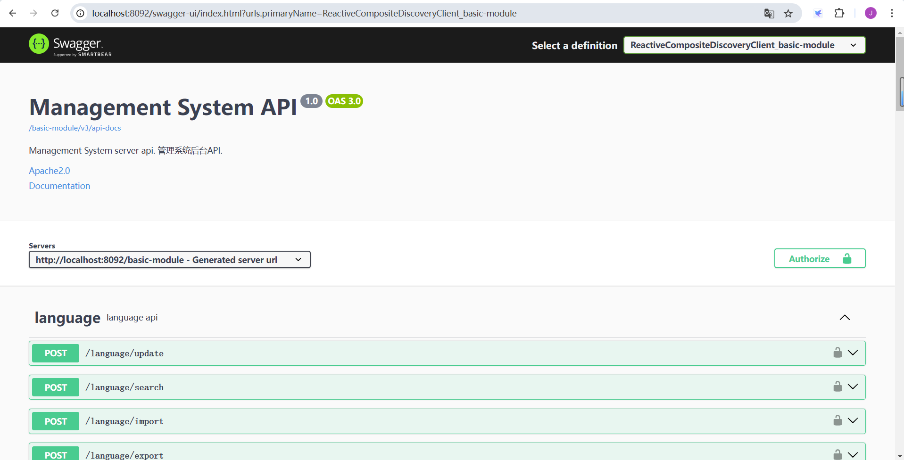
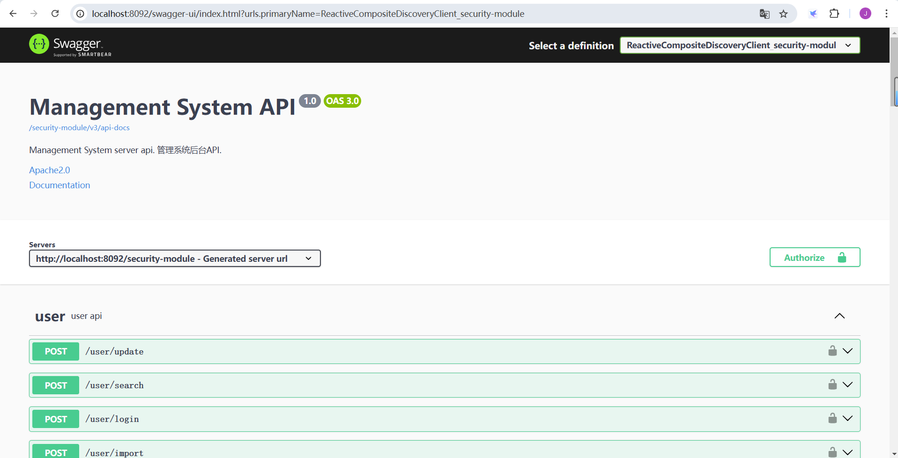

# ManagementSystem
这是一个基于Spring boot，Spring Cloud，mybatis dynamic sql开发的可快速进行后端系统开发的管理系统开发框架。  
系统采用最新的Spring boot 3.2版本开发，封装了可用于快速开发CRUD功能的基类工具类。开发者仅需创建好必须的entity类，数据库表类，及继承基类的mapper，service，controller类或接口，就能快速的实现单表的CRUD功能。

## 使用技术
- Spring boot 3.2
- Spring Cloud 
- mybatis dynamic sql
- Spring Cloud gateway
- nacos
- Spring security
- lombok
- mysql
- redis
- jetcache
- jwt
- springdoc openapi
- Gradle

## 运行环境
- java 17
- mysql 8以上
- redis
- nacos 2.4以上

# 运行步骤
1. 创建数据库managementsystem，使用sql目录下的managementsystem.sql导入数据结构和必要数据
2. 运行redis
3. 运行nacos
4. 使用Intellij IDEA打开项目并编译，安装lombok插件
5. 启动BasicModuleApplication
6. 启动SecurityModuleApplication
7. 启动GatewayApplication
启动成功后，可到浏览器访问http://localhost:8092/api-docs可以看到系统的swagger界面。
在右上角的Select a definition处可以切换不同模块的swagger，效果如下图：

